# Bryst og triceps

|||  
|:-:|:-:|  
| | 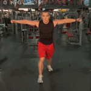|  
|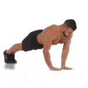 | 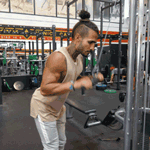|  
|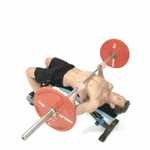 | 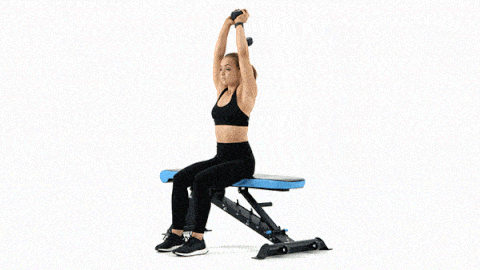|  
| | |  
|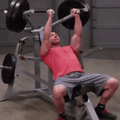 | |  

Cable chest fly (high/low)  
Push ups  
Cable push down (rope / straight bar)

Decline barbell benchpress  
Seated/standing overhead dumbbell extension.  

Triceps kick-back  
Seated pec deck fly

Seated chest press  
Side press  

# Bryst I
Cable cross-over (high-to-low / low-to-high)  
Suspended push-up  
Incline dumbbell bench press  
Barbell bench press  
Seated pec deck machine  

# Bryst II
Close-grip bench press  
Push-ups  
Dip  
Plate press-out  
Reistance band pull-apart  

Source:  
[10 Best Chest Exercises for Men](https://manofmany.com/lifestyle/fitness/10-best-chest-exercises-for-men)

# Legg og bein
Squat  
Dead lift  

Lunge  
Step up  

Leg extension  
Leg curl  

Calf raise (sittende, stående)

# Rygg og skuldrer
Lat pulldown  
Seated cable row  

Bent-over dumbbell row on bench  
Overhead barbell shoulder press  

Standing barbell shrugs  

# Biceps 

|||  
|:-:|:-:|  
|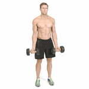 | 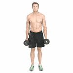|  
|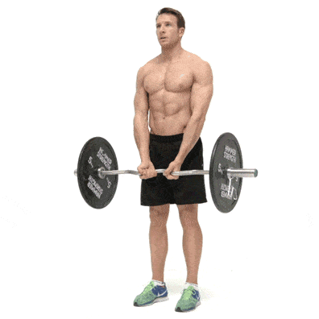 | 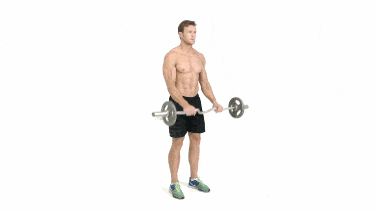|
|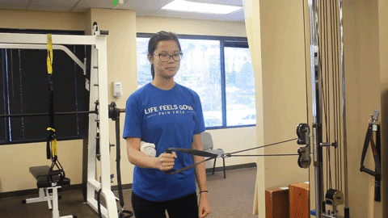 | 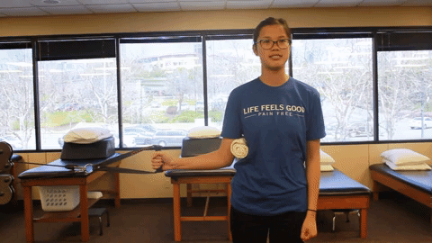|  
|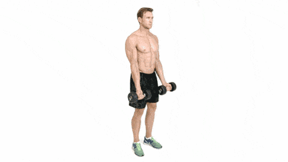|  

(Alternating) dumbbell curls: seated or standing  
(Alternating) hammer curls: seated or standing  

EZ-bar curl: standing or on a preacher bench  
Reverse EZ-bar curl: standing  

Cable rotation innover og utover  
Zottman curl  
