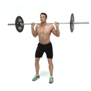
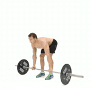

# Mandag: Rygg og biceps

|||  
|:-:|:-:|  
| | |
|||
|||
| | |  

- [ ] EZ-bar curl: standing or on a preacher bench (håndflate opp)  
- [ ] Reverse EZ-bar curl: standing (håndflate ned)  
- [ ] Lat pulldown  
- [ ] Seated cable row  
- [ ] Bent-over dumbbell row on bench  
- [ ] Cable rotation innover og utover  

# Onsdag: Bein og core

|||
|:-:|:-:|
| | |
| | |

- [ ] Markløft eller squats
- [ ] Legg curls
- [ ] Leg extension
- [ ] Woodchipper up and down 
- [ ] Sykling på gulvet

# Fredag: Bryst og triceps

|||  
|:-:|:-:|  
| | |  
| | |  
| | |  
| | |  
| | |  

- [ ] Cable chest fly (high/low)  
- [ ] Push ups eller bench press  
- [ ] Cable push down (rope / straight bar)
- [ ] Seated/standing overhead dumbbell extension eller Triceps kick-back  
- [ ] Seated pec deck fly
