# Uttøying

Dette dokumentet inneholder noen øvelser for uttøying  av ulike kroppsdeler.

## Hip openers 

||||  
|:-:|:-:|:-:|  
|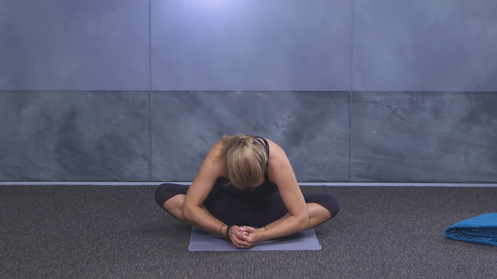 | 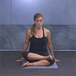 | 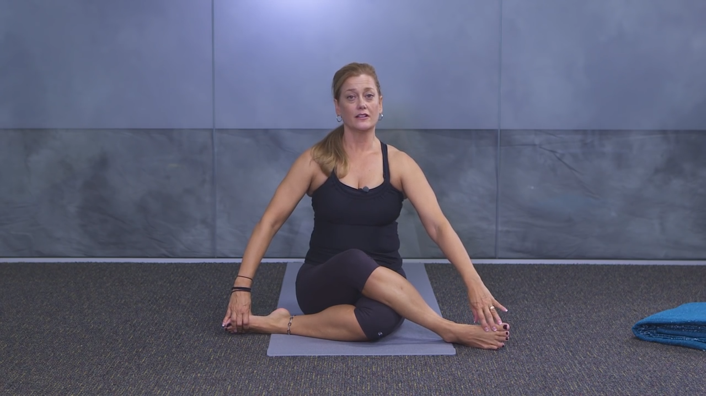|  
|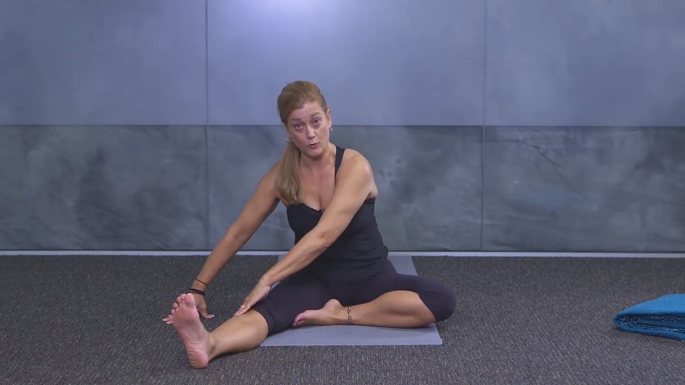 |  | 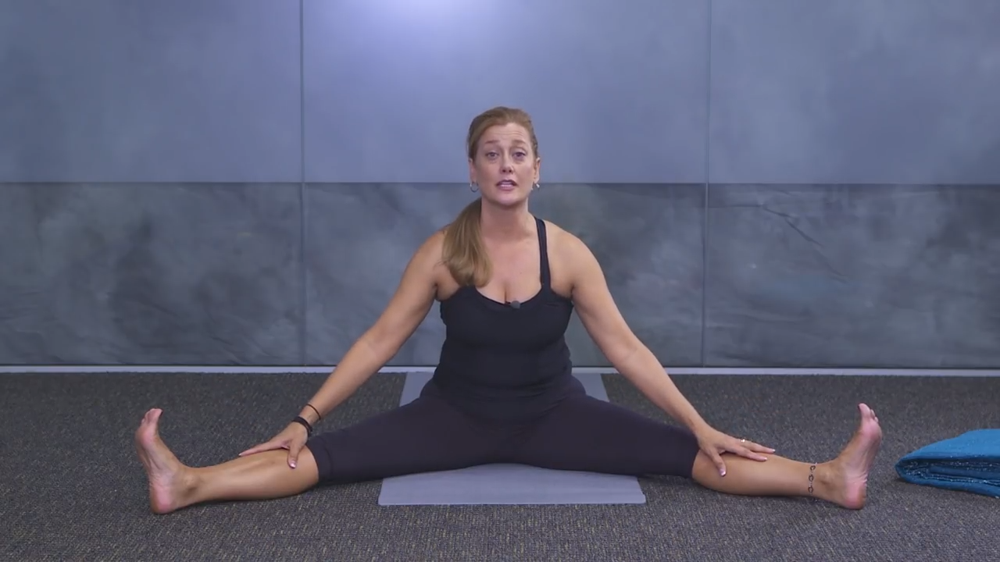|  
| 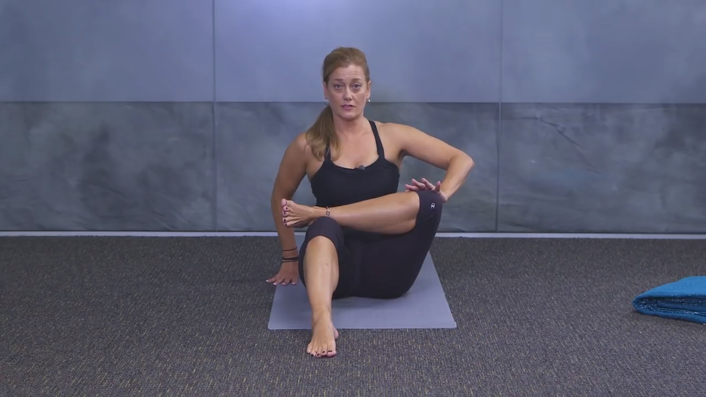 | 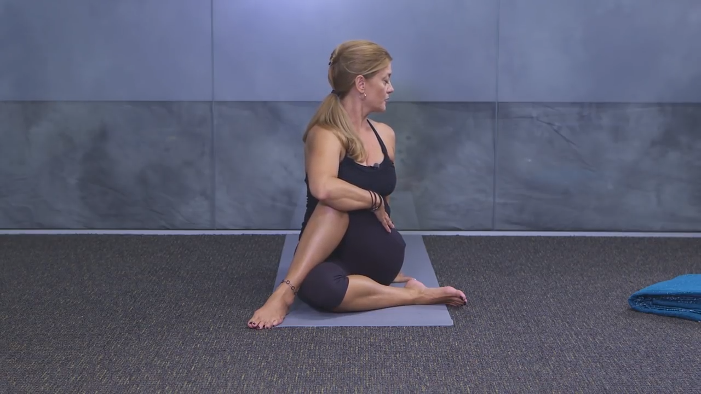 | 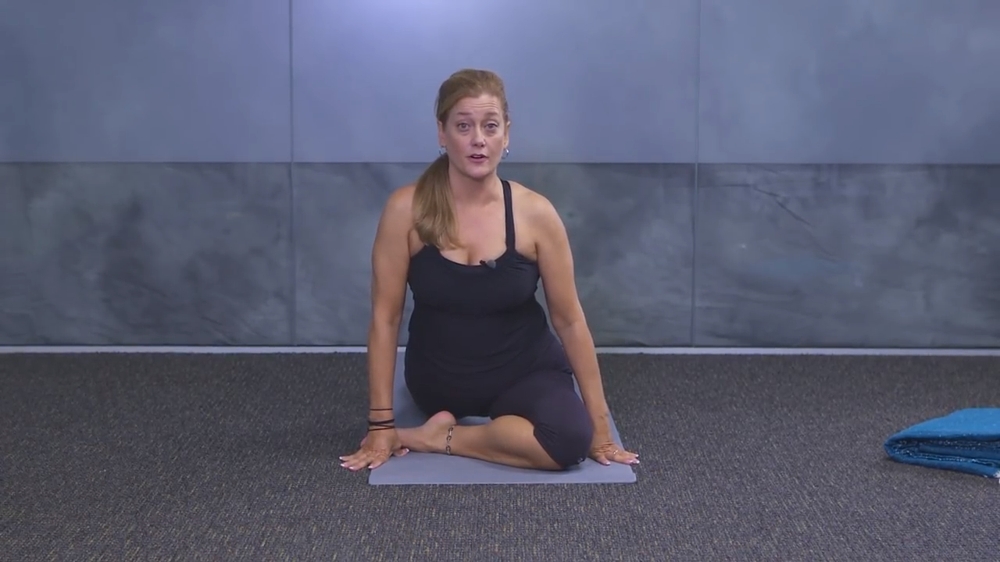 | 

[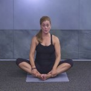](https://www.youtube.com/watch?v=YxKq84cF6Eg&list=PLCNBOxsx5-HxSH4Aj2N8j-7MYCB0YySYV&index=4&t=0s) by Lisa Winters Cox.

* Butterfly (with forward fold)  
* Knee to Ankle  
* Cow Face (with forward fold)  
* A Seated Forward Fold  
* Straddle  
* Figure 4  
* Spinal Twist  
* King Pidgeon  

## Hofte og korsrygg

||||  
|:-:|:-:|:-:|  
|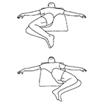 | 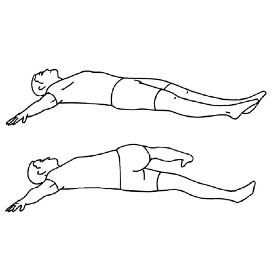 | 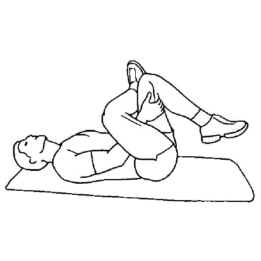|  
|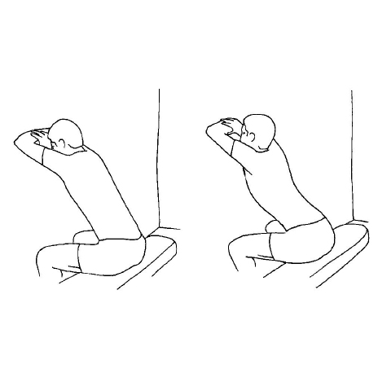 | 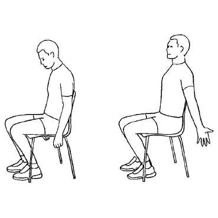 | |  

Av [Nikolai Due Strauman](nikolai-due-strauman_hofta-og-korsryggen.pdf)
* Ryggliggend rotasjon av korsrygg
* Rotasjon av korsrygg i ryggleie
* Liggende figur 4
* Sittende ryggstrekk med veggstøtte
* Sittende ryggstrekk med utadrotasjon av armer
* Sittende figur 4

## Hofte, bein og bryst

||||  
|:-:|:-:|:-:|  
|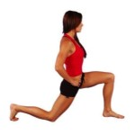 | 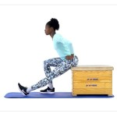 | 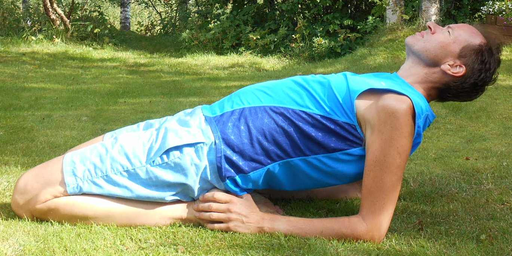|  
|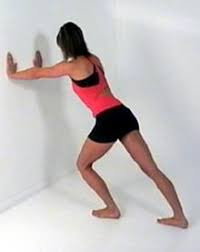 | 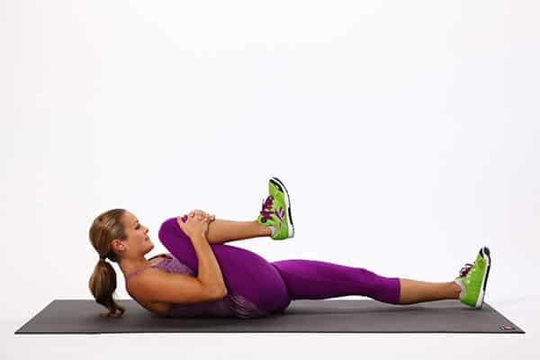 | 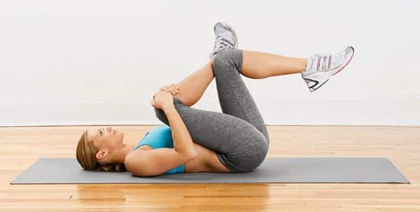|  
| | 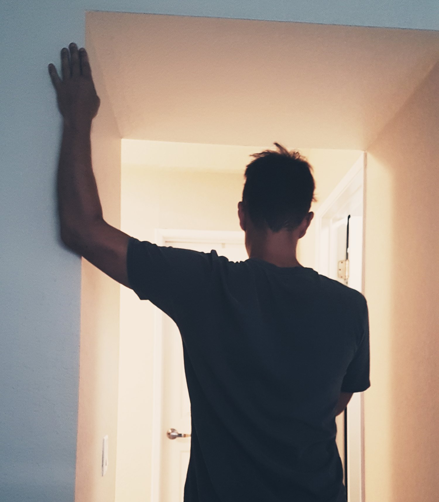 | | 

Av Stian Walle Larsen
* Hip flexor stretch (hofte)  
* Sitting hamstring stretch (med bøyd / strak bein) (hamstring/kalv)  
* Kneeling peroneal stretch (quadriceps) 
* Hamstring stretches (med / uten bøyd kne) (hamstring/kalv)  
* Glute stretch (hofte/rompe) 
* Supine piriformis stretch (hofte)  
* Chest stretch (chest)
