# Uttøying

Dette dokumentet inneholder noen øvelser for uttøying  av ulike kroppsdeler.

## Hip openers 

||||  
|:-:|:-:|:-:|  
|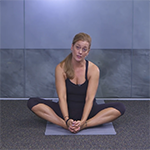 | 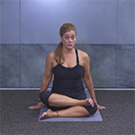 | 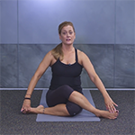|  
|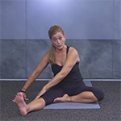 | [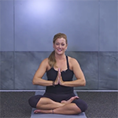](https://www.youtube.com/watch?v=YxKq84cF6Eg&list=PLCNBOxsx5-HxSH4Aj2N8j-7MYCB0YySYV&index=4&t=0s) | 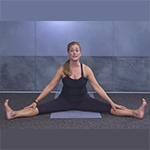|  
| 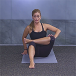 | 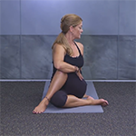 | 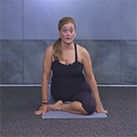 | 

[Hip openers](https://www.youtube.com/watch?v=YxKq84cF6Eg&list=PLCNBOxsx5-HxSH4Aj2N8j-7MYCB0YySYV&index=4&t=0s) by Lisa Winters Cox.

* Butterfly (with forward fold)  
* Knee to Ankle  
* Cow Face (with forward fold)  
* A Seated Forward Fold  
* Straddle  
* Figure 4  
* Spinal Twist  
* King Pidgeon  

## Hofte og korsrygg

||||  
|:-:|:-:|:-:|  
|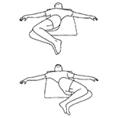 | 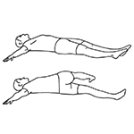 | 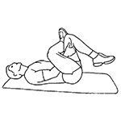|  
|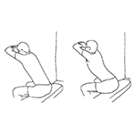 | 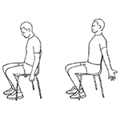 | 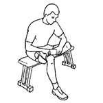|  

Av [Nikolai Due Strauman](nikolai-due-strauman_hofta-og-korsryggen.pdf)
* Ryggliggend rotasjon av korsrygg
* Rotasjon av korsrygg i ryggleie
* Liggende figur 4
* Sittende ryggstrekk med veggstøtte
* Sittende ryggstrekk med utadrotasjon av armer
* Sittende figur 4

## Feet and Leg Stretches

||||  
|:-:|:-:|:-:|  
|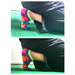 | 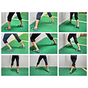 | 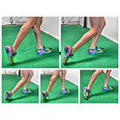|  
|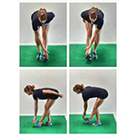 | 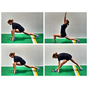 | 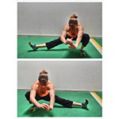|  

[Redefining Strength](https://redefiningstrength.com/35-stretches-stretch-head-toe/) by Cori Lefkowith.

* Kneeling Foot Stretch
* 3-Way Ankle Mobility
* 3-Way Shin Stretch
* Standing Hamstring and Calf Stretch
* Crescent to Hamstring Stretch
* Cossack Squat

## Hofte, bein og bryst

||||  
|:-:|:-:|:-:|  
|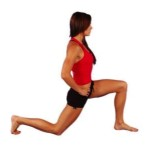 | 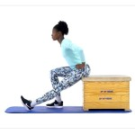 | 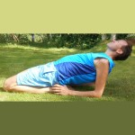|  
|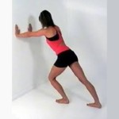 | 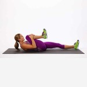 | 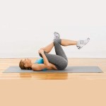|  
| |  | | 

Av Stian Walle Larsen
* Hip flexor stretch (hofte)  
* Sitting hamstring stretch (med bøyd / strak bein) (hamstring/kalv)  
* Kneeling peroneal stretch (quadriceps) 
* Hamstring stretches (med / uten bøyd kne) (hamstring/kalv)  
* Glute stretch (hofte/rompe) 
* Supine piriformis stretch (hofte)  
* Chest stretch (chest)

## Hip Mobility Routine

||||  
|:-:|:-:|:-:|  
|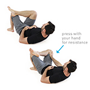 |  | |  
|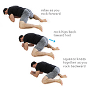 | 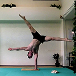 | 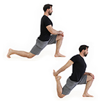|  
|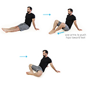 | 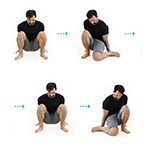 | 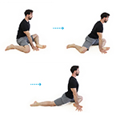| 

[GMB](https://gmb.io/hip-mobility/) by Jarlo Ilano.

* Lying Hip Rotations  
* Piriformis Stretch  
* Butterfly Stretch  
* Frog Stretch  
* Kneeling Lunge  
* Traveling Butterfly
* Squatting Internal Rotations
* Pidgeon Stretch

## Quad Stretches 

||||  
|:-:|:-:|:-:|  
|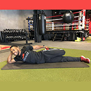 | 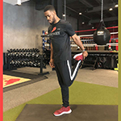 | 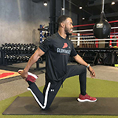|  
|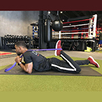 | | 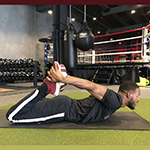|    

[Gloveworx](https://www.gloveworx.com/blog/quad-stretches-help-become-unstoppable/).

* Lying Quad Stretch  
* Simple Quad Stretch
* Kneeling Quad Stretch
* Lying Pidgeon Progression
* Frog Pose

## Hamstring Stretches 

||||  
|:-:|:-:|:-:|  
|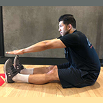 | 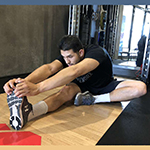 | 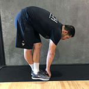|  
|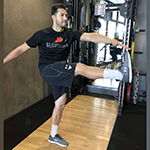 | | 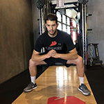|  

[Gloveworx](https://www.gloveworx.com/blog/five-hamstring-stretches-become-unstoppable/).

* Seated Toe Touch
* Hurdler Stretch
* Standing Cross-Leg Toe Touch
* High Kicks
* Standing Butterfly

## Calf Stretches 

||||  
|:-:|:-:|:-:|  
|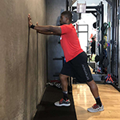 | 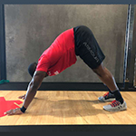 | 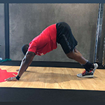|  
|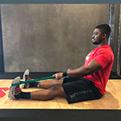 | | 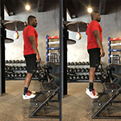|  

[Gloveworx](https://www.gloveworx.com/blog/5-calf-stretches-become-unstoppable/).

* Brace Calf Stretch  
* Downward Facing Dog  
* Plank Crossover Calf Stretch  
* Seated Calf Stretch with Resistance Band  
* Eccentric Calf Raises  

## Core and Upper Body Stretches

||||  
|:-:|:-:|:-:|  
|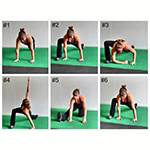 |  | |  
| |  | |  

[Redefining Strength](https://redefiningstrength.com/35-stretches-stretch-head-toe/) by Cori Lefkowith.

* "World's Greatest Stretch"
* Camel
* Child's Pose with Reaches
* Thread the Needle
* Kneeling Wrist Extension Stretch
* Kneeling Wrist Flexion Stretch

## Vogue Chest and Shoulder Stretches

||||  
|:-:|:-:|:-:|  
| | | |
||  | |  

[By Sara Forsberg](./media/bilder/uttoying/2020-03-24_stretches.mp4)

* Lying Chest Stretch
* Kneeling Shoulder Stretch
* Standing Shoulder Stretch (w/ & wo/ reach-around)
* Rubber band reach-around

